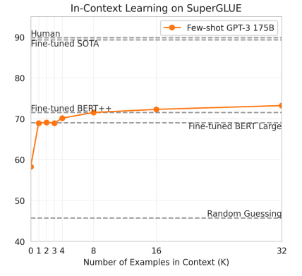
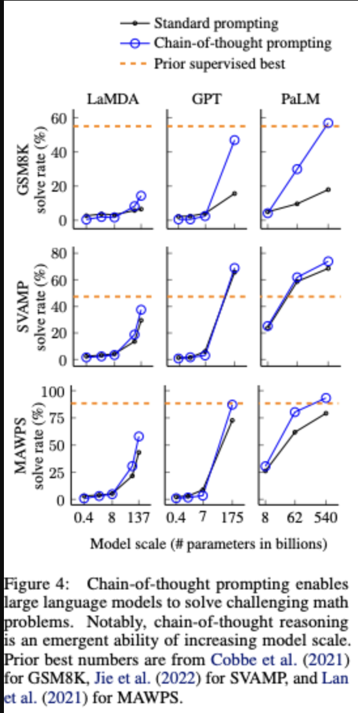
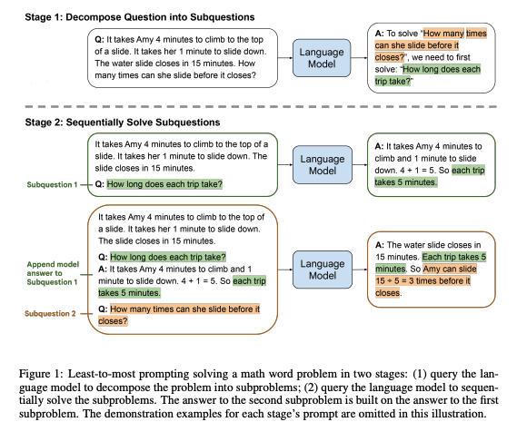
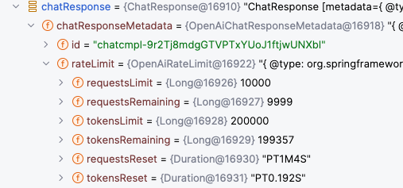

# LLM Prompt Engineering Guide

## 목차 

- [소개](#소개)
    - [프롬프트 작성법과 성능 지표 리뷰](#프롬프트-작성법과-성능-지표-리뷰)
        - [예시를 포함시키기: One-shot, Few-shot](#예시를-포함시키기--one-shot-few-shot)
        - [CoT: Chain of Thought](#cot--chain-of-thought)
        - [Self-Consistency](#self-consistency)
        - [Least-To-Most](#least-to-most)
    - [운영 노하우](#운영-노하우-)
        - [OpenAI API Rate Limit에 주의하세요](#openai-rate-limit-에-주의하세요-)
        - [응답을 고정적인 스펙으로 전달받으세요](#응답을-고정적인-스펙으로-전달받으세요)
        - [송신한 프롬프트와 응답을 저장하세요](#송신한-프롬프트와-응답을-저장하세요)
        - [가능한 적은 Token을 사용하는 프롬프트를 작성하세요](#가능한-적은-token을-사용하는-프롬프트를-작성하세요-)
        - [prompt 입력값으로 가능하면 한국어를 쓰지 마세요](#prompt-입력값으로-가능하면-한국어를-쓰지-마세요)
        - [GPT 4.0 Lo 이상을 사용한다면 GPT에 초안 작성을 의뢰해보세요](#gpt-40-lo-이상을-사용한다면--gpt에-초안-작성을-의뢰해보세요)

---

# 소개

LLM prompt를 효과적으로 작성하는 방법에 대해 다룹니다.

프롬프트 엔지니어링 관련하여 인용이 800회 이상된 대표적인 논문에 대해 소개하고, 해당 논문에서 밝힌 성능차이에 대해 제시합니다.


프로젝트의 운영 과정에서 있던 팁들에 대해서도 소개합니다. openAi의 rate limit 정책과 llm 을 사용하는 서비스에서 고려할만한 팁들을 작성했습니다.  

---

## 프롬프트 작성법과 성능 지표 리뷰

이 챕터에서 언급하는 "성능"은 throughput이 아니라, 얼마나 의도에 맞는 답을 도출했는가의 비율을 의미합니다.

프롬프트 작성 관련하여 인용이 많이 된 논문과 대표적으로 쓰이는 기법에 대해 서술합니다. 각 방법에 대한 as-is, to-be 성능차이를 스크린샷으로 포함시켰습니다. 

### 예시를 포함시키기 : one-shot, few-shot

[대표 논문링크:Language Models are Few-Shot Learners](#https://papers.nips.cc/paper_files/paper/2020/file/1457c0d6bfcb4967418bfb8ac142f64a-Paper.pdf)

one-shot, few-shot 에서의 shot 은 예시를 준다는 뜻입니다. one-shot은 예시 한개를 프롬프트에 추가 시킨 것이고, few-shot 은 여러개 두었다는 뜻입니다.
위의 논문에서는 20년도 기준 각 대규모 llm 모델에서  프롬프트에 포함시킨 예시의 갯수와 성능을 비교하는 논문입니다.

아래는 위 논문의 내용에 따르면, LLM에 명령을 줄 때 예시를 제공하는 것이 성능 차이가 발생함을 확인하고 있습니다.
입력 예시의 개수와 성능이 정비례하지는 않으며, 10개 이상의 예시부터는 성능 증가가 유의미하지 않았습니다. 따라서 입력 토큰 수와의 가성비를 고려해 1~3개의 예시를 추가하는 것을 추천드립니다.

입력 토큰 수와의 가성비를 생각해서 1~3 개의 예시입력을 추가하는 것을 추천드립니다.



### Cot : chain of thought


[관련 논문 :Chain-of-Thought Prompting Elicits Reasoning
in Large Language Models](#https://openreview.net/pdf?id=_VjQlMeSB_J)

예시를 주되, 예시가 정답을 추론하는 과정을 설명하는 것입니다. 논문의 예시는 아래와 같습니다.

사실 방법 자체는 새로울 것이 없으나, 이따금 다른 논문에서 Cot 의 갯수등의 변인을 성능과 연관시키는 경우가 많기 때문에 단어를 알아두면 좋습니다.

아래는 논문에서 소개된 COT 한 프롬프트와 그렇지 않은 경우의 예시입니다. COT 한 예시에서는 질문과 수식을 연관짓는 구문이 하나 더 포함되어 있음을 확인할 수 있습니다.

- 적용이 안된 예시

```
[model input]
Q: Roger has 5 tennis balls. He buys 2 more cans of
tennis balls. Each can has 3 tennis balls. How many
tennis balls does he have now?

A: The answer is 11.

Q: The cafeteria had 23 apples. If they used 20 to
make lunch and bought 6 more, how many apples
do they have?

[model output]
A: The answer is 27. => WRONG ! 
```

- 적용된 예시

```
[model input]
Q: Roger has 5 tennis balls. He buys 2 more cans of
tennis balls. Each can has 3 tennis balls. How many
tennis balls does he have now?

A: Roger started with 5 balls. 2 cans of 3 tennis balls
each is 6 tennis balls. 5 + 6 = 11. The answer is 11.

Q: The cafeteria had 23 apples. If they used 20 to
make lunch and bought 6 more, how many apples
do they have?

[model output]
A: The cafeteria had 23 apples originally. They used
20 to make lunch. So they had 23 - 20 = 3. They
bought 6 more apples, so they have 3 + 6 = 9. The
answer is 9.

```

- COT 퍼포먼스 비교

아래의 이미지도 위 링크의 논문의 성능 측정결과입니다.

GPT 3.5 정도의 대규모 모델에서는  COT 의 예시를 주는것이 그렇지 않은 것보다 효율적임을 확인할 수 있습니다.



### Self-Consistency


[대표 논문: SELF-CONSISTENCY IMPROVES CHAIN OF THOUGHT
REASONING IN LANGUAGE MODELS](#https://openreview.net/pdf?id=1PL1NIMMrw)

위의 COT 의 Q와 A 질의를 여러개 만든 다음 가장 많이 정답으로 채택된 답을 채택하는 방식입니다.
사실, openai 과금된 api 를 쓰려면 이런 토큰이 많이 들어가는 방식은 피하게 되기도 합니다.

하지만 수학과 관련한 작업을 수행하는 경우에는 성능을 확보할 수 있는 방법이기도 합니다.

필자는 써보지 않았지만 소개하는 차원에서 남깁니다.


### Least-To-Most

[대표 논문: LEAST-TO-MOST PROMPTING ENABLES COMPLEX
REASONING IN LARGE LANGUAGE MODELS](#https://openreview.net/pdf?id=WZH7099tgfM)

어떤 작업을 한 번에 처리하지 않고 순서대로 프롬프트를 호출하는 방식입니다. 논문 예시에서는 이전의 컨텍스트를 다음 질문에 포함시키기 위해 이전 질문과 응답을 모두 다음 컨텍스트에 추가했습니다.



이 방법은 수학적인 추론이 있는 경우 특히 유리하다고 할 수 있습니다. 자세한 제약사항과 테스트환경은  논문링크를  참고해주세요 .

---

## 운영 노하우 

### Openai rate limit 에 주의하세요 

OpenAI의 rate limit 기준은 다른 api와 다르기 때문에 주의가 필요합니다. OpenAI는 보통 API 요청 수를 제한할 뿐만 아니라, **모델에 대한 총 토큰 수를 시간 단위로 제한하기 때문에 이에 대한 관리가 필요합니다.**

아래는 Spring의 spring-ai를 통해 확인한 응답의 rate limit 값입니다. 시간 단위 req 수 뿐만 아니라 token 수 까지 제한함을 확인할 수 있습니다.



**토큰/분을 고려해야 합니다.** 제일 저렴한 과금제의 경우 1분당 20만 토큰을 사용할 수 있습니다. 문서 하나가 3000 토큰이라고 가정하면, 분당 60개 정도의 문서만 처리할 수 있습니다. 요금제를 변경하여 200만 토큰이라도 분당 600개의 문서밖에 처리할 수 없습니다.

따라서, 장기적으로 사용하거나 트래픽이 점점 늘어날 경우 설치형 LLaMA를 이용하여 rate limit 걱정 없이 운영하는 것도 좋은 선택지가 될 수 있습니다.

그리고 실제 OpenAi api 호출을 통해 운영을 하려면, 위의 rate limit 에 대한 장애처리를 필수적으로 수행을 해야 하는데 그에 대한 best practice 문서링크를 첨부합니다.

[링크:What are the best practices for managing my rate limits in the API?](#https://help.openai.com/en/articles/6891753-what-are-the-best-practices-for-managing-my-rate-limits-in-the-api)


### 응답을 고정적인 스펙으로 전달받으세요

API 응답을 파이프라인이나 서비스에 사용하기 위해 고정된 스펙의 응답을 받는 것이 중요합니다. JSON 예시로 응답 스펙을 미리 보여주고, temperature를 낮게 설정해 고정된 스펙의 응답을 받아 서비스에 적용하세요.

### 송신한 프롬프트와 응답을 저장하세요

현재까지의 정보로는 좋은 template 은 경험적으로 얻어질수 밖에 없습니다.
ml 모델 특성상, input 과 output 의 명확한 연관을 개발자가 파악할 수 없습니다.


서비스 운영에서 전송하고 있는 template 들은 이후에 다른 template 을 테스트하기 위한 정보가 되기도 하고, 운영 중 명백히 좋은 template 이 생긴 경우 일괄적으로 수정할 수 있는 파라미터가 되기도 합니다.

따라서 운영중, 특히 초기에는 모든 응답, 요청 프롬프트를 로깅하거나 db에 임시적으로 저장해놓기를 추천합니다.
저는 prompt 기록용 mysql database 를 따로 두고 input 과 output 을 저장하는 식으로 관리하고 있습니다.

### 가능한 적은 token을 사용하는 프롬프트를 작성하세요 

경험상, 입력 프롬프트가 크고 내용이 많다고 해서 의도에 맞는 답을 도출하는 것은 아닙니다. 위의 논문 내용도 보편적으로 그러하다는 것이고, 결국 하나하나 테스트하면서 결과를 직접 보면서 확인해야 합니다.

운영 중에 압박감을 느끼는 것은 절대적으로 토큰의 개수입니다. 반복되는 표현이 있거나 간략하게 표현할 수 있다면 해당 표현은 최대한 줄이는 것이 좋습니다.


### prompt 입력값으로 가능하면 한국어를 쓰지 마세요

해석과 출력에 소모되는 토큰의 수가 영어에 비해 압도적으로 많습니다. 


### GPT 4.0 lo 이상을 사용한다면  GPT에 초안 작성을 의뢰해보세요

GPT 3.5 까지는 아니지만 GPT 4.0 은 2023 년까지의 정보를 가지고 있습니다.
23년이면 위의 논문의 정보을 포함한 llm 프롬프트 엔지니어링에 대한 기초적인 정보를 포함하고 있습니다.

따라서 나쁘지 않은 수준의 프롬프트를 여러개 양산할 수 있습니다.

생성된 프롬프트로 테스트하고 위의 논문의 방식이나 다른 프롬프트 엔지니어링 방법을 통해서 프롬프트를 강화해보세요.


